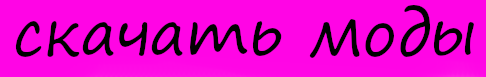

<h1>Преглашаю тебя поиграть со мной в майнкрафт</h1>

<body>

</body>
<h1>IP сервера------> sadnessgaming.mcsh.io версия 1.20.1</h1>
<meta name="viewport" content="width=device-width,initial-scale=1,maximum-scale=1"/>
